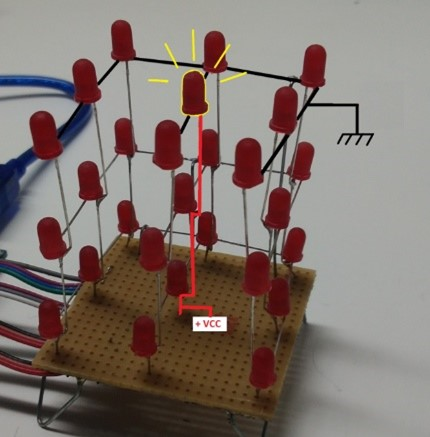

# Cube-led-3x3x3 # 

## Objectif : ##

Projet visant à la réalisation d&#39;un objet de décoration. Utilisant la couleur des leds pour créer des animations.

## Matériels utilisés : ##

- 27 leds rouges,
- 9 résistances de 220 Ohm permettant d&#39;ajuster la tension de la carte arduino
- 3 résistances de 22 k Ohm
- 3 transistors
- Carte arduino

## Principe : ##

Une led laisse passer le courant seulement dans un sens, on l&#39;allume en alimentant sa cathode (branche la plus longue) et en reliant son anode à la masse.

  

Dans le cube à led, toutes les anodes sont communes à chaque étage et les cathodes sont communes à chaque colonne. Pour allumer une led, il suffit d&#39;alimenter la colonne choisit et de commander le transistor afin de relier l&#39;étage de la led à la masse.

  

Cependant cette disposition peut entrainer des effets indésirés. Par exemple lorsque l&#39;on veut alumer 2 leds à 2 étages et colonnes différentes, 2 leds en plus sont alimentées par défauts.

Il n&#39;est donc pas préférable de commander plusieurs leds à la fois.

L&#39;astuce du système est de ne jamais allumer plus d&#39;une led à la fois tout en ayant une fréquence d&#39;allumage suffisament grande afin de finter l&#39;œil humain. En effet, en faisant clignoter une led avec une fréquence supérieur à celle de l&#39;œil humain ( supérieur à 85 Hz), on a l&#39;impression que la led est alumée normalement.

On peut donc réaliser différentes figures avec les leds tout en contournant le problème.
